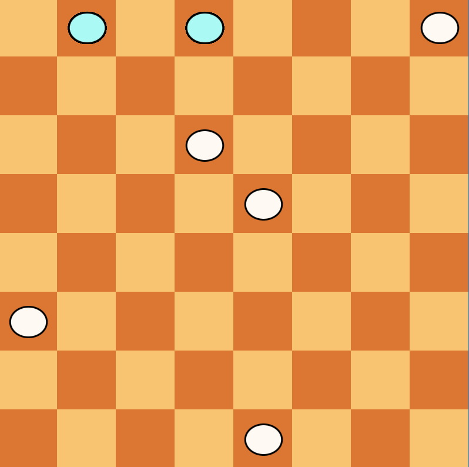

# Checker Game
---------------------------
### by Phanuwatch Luangpradit

This game is played by two opponents. One player has dark pieces and the other has white pieces. Players alternate turns. Two player play in the same computer screen. Using mouse to drag and drop the pieces. This game has two kind of pieces. 
One is the normal piece and the other is king piece. 

Download Game [here](https://github.com/France98/CheckerGame/blob/master/Checker.jar)

## UML

## How to play

1. Click the start button

2. After that, you can click and drag the piece by start at white piece.

3. When you reach the king rows, the normal piece will change to king piece.

4. You can move King White backward and forward by 1 tile.

5. If there is no piece of one color the other, color will win.

